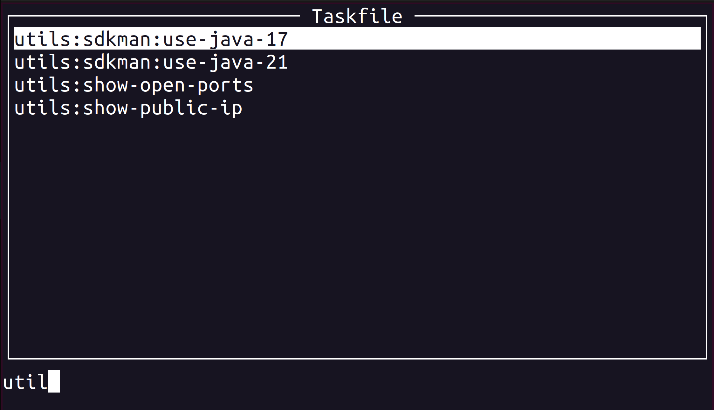

# Terminal user interface for Task

What is [Task and Taskfile](https://taskfile.dev/)?
> Task is a task runner / build tool that aims to be simpler and easier to use than, for example, [GNU Make](https://www.gnu.org/software/make/).

> Once [installed](https://taskfile.dev/installation), you just need to describe your build tasks using a simple [YAML](http://yaml.org/) schema in a file called Taskfile.yml

The tool is a client with a user interface for the [Task](https://taskfile.dev/) that makes it easier to run tasks from the terminal.



## Features

- list and launch tasks
- filter tasks

🟥 __The [labels](https://taskfile.dev/usage/#overriding-task-name) are not properly supported right now__ 🟥

If you are using [labels](https://taskfile.dev/usage/#overriding-task-name), you must also specify [namespace alias](https://taskfile.dev/usage/#namespace-aliases) or [task alias](https://taskfile.dev/usage/#task-aliases) for these tasks.

## Usage

```bash
# run for a default taskfile
task-tui
# or specify the taskfile explicitly
task-tui -t ./Taskfile.yml
# ask for help
task-tui --help
```

#### Hotkeys

`/` - to enter filtering mode  

## Installation

Make sure that Task is [installed](https://taskfile.dev/installation/).

#### Homebrew tap

```bash
brew install aleksandersh/task-tui/task-tui
```

#### Go install

Requires Go 1.22

```bash
go install github.com/aleksandersh/task-tui@latest
```

## Best practice

#### Use terminal aliases

Improve your productivity by setting up terminal [aliases](https://www.gnu.org/software/bash/manual/html_node/Aliases.html) for frequently used taskfiles.

###### Bash example

```bash
$ echo $'alias task-tui-sample=\'task-tui -x -t "$HOME/taskfile-tui/sample"\'' >> "$HOME/.bash_aliases"
$ source "$HOME/.bash_aliases"
$ task-tui-sample
```
